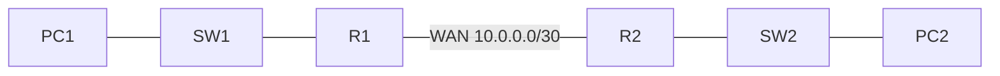

# Topology 1: два офиса через WAN-линк

```mermaid
graph LR
    PC1---SW1
    SW1---R1
    R1---|WAN 10.0.0.0/30|R2
    R2---SW2
    SW2---PC2
```

- LAN1: 192.168.1.0/24
- LAN2: 192.168.2.0/24
- WAN: 10.0.0.0/30
